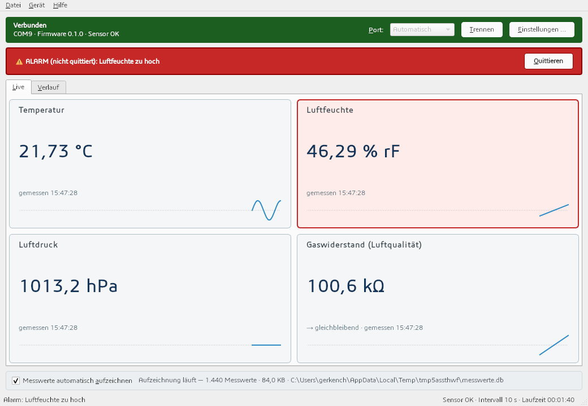

# Umgebungssensoren

> Arduino-Anzeige für **Umgebungssensoren**: Temperatur, Luftfeuchte, Luftdruck und
> Luftqualität (BME680) auf einem Touch-Display — plus ein Python-PC-Tool zum Auslesen und
> Protokollieren. Entwickelt mit einem AI-Workflow aus spezialisierten Claude-Code-Skills
> (Spec, Architektur, Firmware, PC-Tool, QA, Release), übernommen von
> [GloveboxControl](https://github.com/chriscodego/GloveboxControl).

- **Firmware:** Arduino Uno R3, BME680 (I2C), Joy-IT 1.8" ST7735-Touchscreen (160×128), EEPROM — läuft autark, ohne PC
- **PC-Tool:** Python ≥ 3.11 + `pyserial`: CLI, Live-`monitor` mit CSV-Messprotokoll, Tkinter-GUI
- **Vertrag:** zeilenbasiertes Serial-Protokoll in [`docs/SPEC.md`](docs/SPEC.md)

> **Status:** Projektgerüst (Workflow, Regeln, Agents) steht. Code folgt Feature für Feature,
> beginnend mit `/init` und der Analyse der bereits auf dem Gerät (COM9) vorhandenen Firmware.

## Quick Start

```bash
# Firmware
arduino-cli compile --fqbn arduino:avr:uno --warnings all firmware/Umgebungssensoren
arduino-cli board list                                    # Port finden (aktuell COM9)

# PC-Tool
python -m venv .venv
.venv\Scripts\activate
pip install -e "pc[dev]"
python -m umwelt_ctl ping
python -m umwelt_ctl monitor --csv messwerte.csv

# Tests
python -m pytest pc/tests
python -m pytest pc/tests -m hardware
```

`arduino-cli.exe` liegt unter `C:\Program Files\Arduino CLI\` (nicht im PATH).
Der Port wird automatisch gefunden (USB-VID 0x2341); sonst `--port COM9` oder `UMWELT_PORT=COM9`.

## Control Panel

Desktop-Oberfläche (PySide6) analog zum „RFB Controll Panel": vier Wert-Kacheln mit Verlaufskurve,
Verbindungsbanner (Port, Firmware), Alarmband mit „Quittieren", Einstellungsdialog (Intervall,
Temperatur-Offset, Schwellwerte, Piezo, Standardwerte, Uhr) und ein **dauerhaftes Messwert-Log in
SQLite** mit Verlaufsansicht (1 h / 24 h / 7 Tage / alles) und CSV-Export.

```bash
pip install -e "pc[panel]"       # PySide6 + platformdirs (die CLI bleibt pyserial-only)
umwelt-panel                     # oder: python -m umwelt_panel [--port COM9] [--db DATEI]
```

Die Datenbank liegt standardmäßig in `%LOCALAPPDATA%\Umgebungssensoren\messwerte.db` (lokal, nicht im
Repo); sie wächst unbegrenzt und wird nur nach Rückfrage gelöscht. Details: `docs/configuration.md`.



## The Workflow

| Step | Skill | What it does |
|------|-------|--------------|
| 1 | `/init` | PRD and prioritized feature map (once, at the start) |
| 2 | `/write-spec` | Full spec for one feature: user stories, acceptance criteria, edge cases |
| 3 | `/architecture` | Technical design in plain language: screens, EEPROM/RAM, sensor, protocol impact |
| 4 | `/firmware` | Device side: modules, compile, resource check |
| 5 | `/pc` | PC tool side: protocol client, CLI, monitor, GUI |
| 6 | `/qa` | Host tests + hardware-in-the-loop against acceptance criteria |
| 7 | `/release` | Version, flash the device, install the PC tool, tag |
| 8 | `/archive` | Archive released specs, reset tracking for the next cycle |

Plus `/flash`, `/integrity`, `/autonom`, `/refine PROJ-X`, `/help`.
Every skill reads `features/INDEX.md` at the start and updates it when done.

## Project Structure

```
firmware/Umgebungssensoren/   Arduino sketch, config.h, modules
pc/                           Python PC tool (src/umwelt_ctl, tests)
docs/                         SPEC (contract), PRD, Entwicklerhandbuch, hardware, configuration,
                              EEPROM layout history, release notes
features/                     Feature specs (PROJ-X-name.md) + INDEX.md + archive/
.github/workflows/            CI: firmware compile + PC host tests
.claude/                      skills/ (+ LESSONS.md je Skill), rules/, agents/, settings.json
```

## Conventions

- **Feature IDs:** PROJ-1, PROJ-2, ... · **Commits:** `feat(PROJ-X): …`, `fix(PROJ-X): …`
- **SPEC.md is the contract** — protocol changes touch SPEC, firmware, PC tool and tests together
- **Firmware:** no `String`, no heap, no `delay()` in the loop, everything in `config.h`
- **Language:** code and commits in English; specs and PC-tool texts in German with real umlauts
